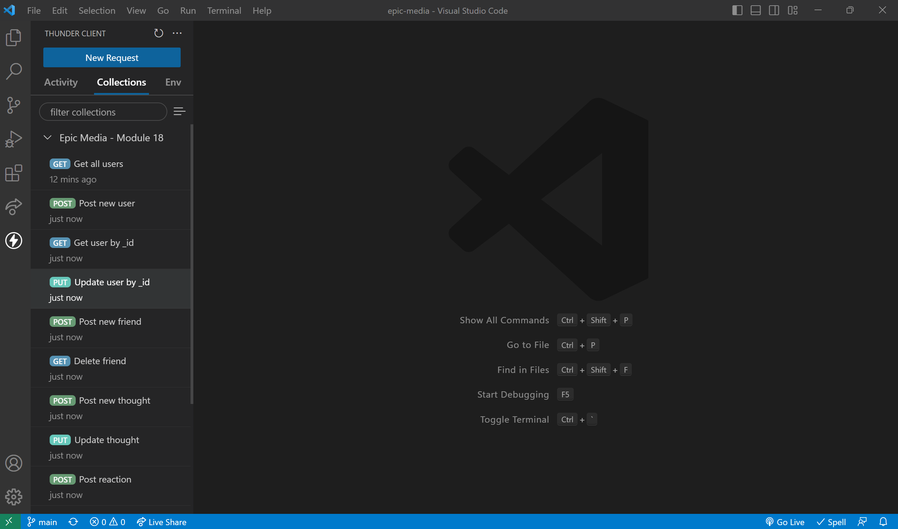
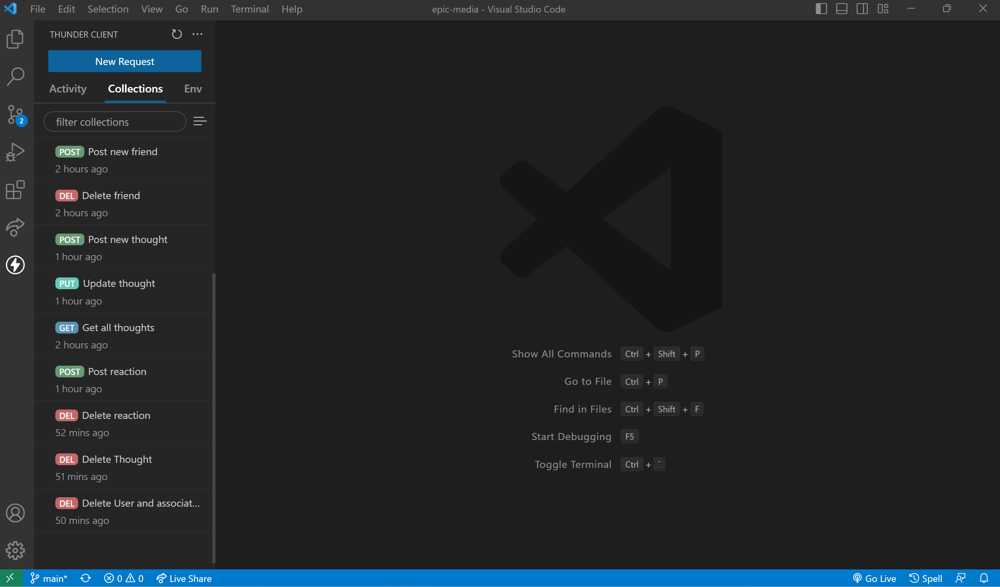
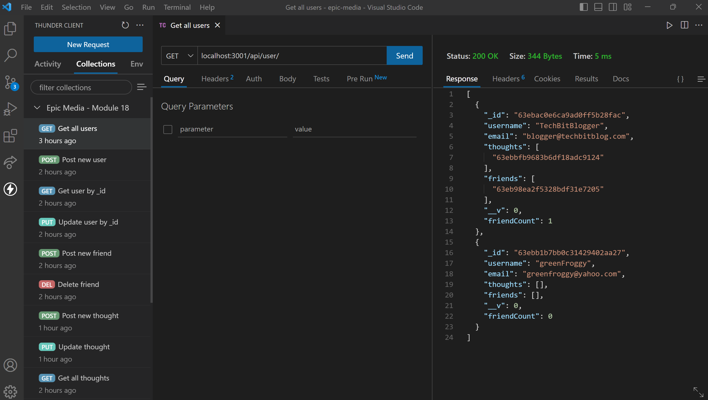
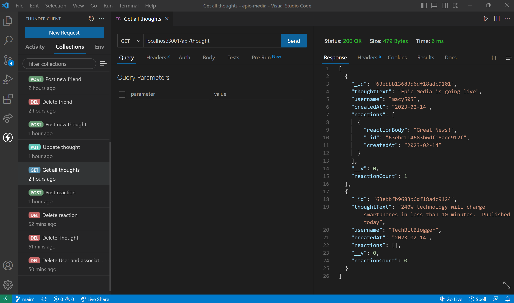

# epic-media

Social Network API

---

## Table of Contents

- [Description](#description)
- [API Routes](#api)
- [Installation](#installation)
- [Test](#test)
- [License](#license)
- [Links](#links)
- [Screenshot](#screenshot)

## Description

---

This is an API for a social network web application where users can share their thoughts, react to friends’ thoughts, and create a friend list.

---

GIVEN a social network API

WHEN I enter the command to invoke the application

THEN my server is started and the Mongoose models are synced to the MongoDB database

WHEN I open API GET routes in Thunder Client for users and thoughts

THEN the data for each of these routes is displayed in a formatted JSON

WHEN I test API POST, PUT, and DELETE routes in Thunder Client

THEN I am able to successfully create, update, and delete users and thoughts in my database

WHEN I test API POST and DELETE routes in Thunder Client

THEN I am able to successfully create and delete reactions to thoughts and add and remove friends to a user’s friend list

## API

---

`/api/user`

`GET` all users

`GET` a single user by its \_id and populated thought and friend data

`POST` a new user

`PUT` to update a user by its \_id

`DELETE` to remove user by its \_id

`/api/users/:userId/friends/:friendId`

`POST` to add a new friend to a user's friend list

`DELETE` to remove a friend from a user's friend list

`/api/thought`

`GET` to get all thoughts

`GET` to get a single thought by its \_id

`POST` to create a new thought

`PUT` to update a thought by its \_id

`DELETE` to remove a thought by its \_id

`/api/thought/:thoughtId/reactions`

`POST` to create a reaction stored in a single thought's reactions array field

`DELETE` to pull and remove a reaction by the reaction's reactionId value

## Installation

Express.js

MongoDB

Mongoose ODM

_Start the server_

nodemon server.js

---

## Test

---

Testing restful API calls with Thunder Client

## License

---

MIT License

## Links

---

GitHub: https://github.com/krgurevich/epic-media

Google Drive Link: https://drive.google.com/file/d/1gR0vPhyUxmLTmvl2KoNUrfwnyf52uBzP/view?usp=sharing

## Screenshot

---

